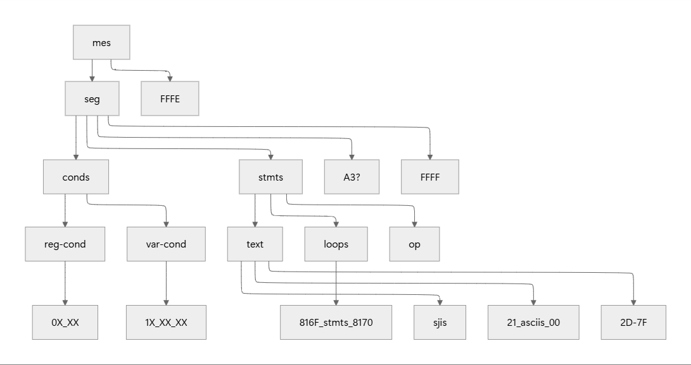
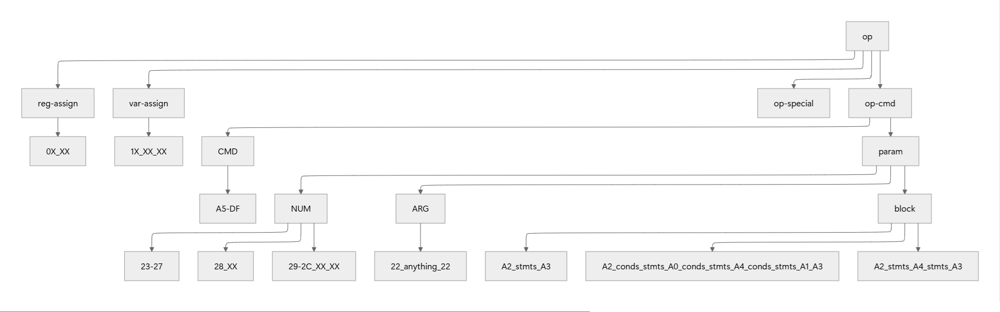
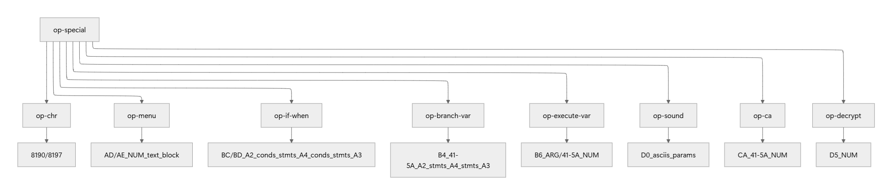

This repo is forked from [tomyun/juice](https://github.com/tomyun/juice)

## Difference
- Fixed an inconsistency error when recompiling some ADV MES files (e.g. **X-Girls**, **Pia Carrot**).
- 

Support Chinese charset.

    * 反编译和编译时**不要**(也不用)指定 `--charset chinese`，只在翻译完 rkt 文件后，将每个文件的第一处 `(charset "pc98")` 改为 `(charset "chinese")` 即可。编译指令会自动找到 `_charset_chinese.rkt` 文件并用它编码中文。
    * 中文 charset 配套的码表文件为 `font/font-chinese.bmp`。如果要自己生成，生成前先安装 `font/unifont-Medium.ttf`。生成后 bmp 要另存为 2 bit 位图（比如用 win 的画图打开 bmp，然后另存为 bmp，保存类型选择"单色位图"）
  

- Fixed **Dengeki Nurse** compile error.

## Note
Decompile rules for `--engine ADV --extraop`

## Some Script Syntax Summaries

<strong>branch-var</strong>

<pre><code>
(set-var A 0)
(branch-var A
(</>
    (/ (str "A is 0"))
    (/ (str "A is 1"))
    (/ (str "A is 2"))
    (/ (str "A is 3"))
))
</code></pre>
Equivalent to
<pre><code>
A = 0
switch (A) {
    case 0:
    console.log("A is 0")
    break
    case 1:
    console.log("A is 1")
    break
    case 2:
    console.log("A is 2")
    break
    case 3:
    console.log("A is 3")
    break
}
</code></pre>

<strong>branch-reg</strong>

<pre><code>
(set-reg 80 #t)
(branch-reg 80
    (</> 
        (/ (str "reg 80 is false")) 
        (/ (str "reg 80 is true"))
    )
)
</pre></code>
Equivalent to
<pre><code>
reg[80] = true
if (reg[80] === false) {
    console.log("reg 80 is false")
} else {
    console.log("reg 80 is true")
}
</pre></code>

<strong>if</strong>

<pre><code>
(set-var A 1)
(set-var B 1)
(if (</> 
    (// (? (= A 1)) (str "A is 1"))
    (// (? (= B 2)) (str "B is 2"))
    (// (nop@) (str "A is not 1 and B is not 2"))
))
</pre></code>
Equivalent to
<pre><code>
A = 1
B = 1
if (A == 1) {
    console.log("A is 1")
} else if (B == 2) {
    console.log("B is 2")
} else {
    console.log("A is not 1 and B is not 2")
}
</pre></code>

<strong>when</strong>

<pre><code>
(set-var A 1)
(set-var B 1)
(proc 0)
(when (</>
    (//  (? (= A 1))
        (str "A = 1") (wait) (text-reset)
    )
    (//  (? (= A 0))
        (str "A = 0") (wait) (text-reset)
    )
    (//  (? (= B 1))
        (str "B = 1") (wait) (text-reset)
    )
))
</pre></code>
Equivalent to
<pre><code>
A = 1
B = 1
if (A == 1) {
  console.log("A = 1")
}
if (A == 0) {
  console.log("A = 0")
}
if (B == 1) {
  console.log("B = 1")
}
</pre></code>

<strong>seg-call</strong>

`seg-call` exits the current seg block and scans subsequent seg blocks in the file in order. It executes the first seg block whose condition matches, then returns to the point where seg-call was invoked to continue execution.
<pre><code>
(seg*
  (str "before seg call") (wait) (text-reset)
  (V = 3)
  (seg-call)
  (str "after seg call") (wait) (text-reset)
)
(seg (= V 2)
  (str "foo") (wait) (text-reset)
)
(seg*
  (str "bar") (wait) (text-reset)
)
(seg
  ...
)
</pre></code>
Output:
<pre><code>
before seg call
bar
after seg call
</pre></code>

<strong>mes-load?</strong>

`mes-load?` loads a `.mec` file into memory and executes it.

* `(mes-load? "file path" address)` loads a .mec file into the specified memory address.
* `(mes-load? address)` executes the .mec file previously loaded into that address.
<pre><code>
(mes-load? "b:¥mes¥system.mec" 0)
(mes-load? 0)
(mes-load? "b:¥mes¥y_a003c.mec" 4096)
(mes-load? 4096)
</pre></code>

